 

## Hi, I'm mixutin

I'm a cybersecurity specialist who loves playing CTFs (capture-the-flag security competitions).
Most of what I build starts with taking something apart to see how it works.

- **Reverse engineering.** Game preservation and binary analysis: Windows PE files, x86-64
  disassembly and Unreal Engine 4 internals. When a game's official servers shut down, I work out
  what the client expected from them so it can be played again.
- **Backend and servers.** The services that games and apps talk to: APIs, databases and the
  tooling to run them.
- **Systems programming.** Code close to the machine, in C and C++.
- **Game dev and tools.** Unity, Roblox (Luau), Blender, and tools that make that work faster.

## Skills

| Area | Tools and languages |
|---|---|
| Reverse engineering |     |
| Backend and servers |         |
| Systems programming |     |
| Game dev and tools |     |
| Also |     |

## Featured project: Dauntless Revived

Dauntless was Phoenix Labs' free-to-play co-op monster-hunting game. Its official servers shut down
on 30 May 2025. **Dauntless Revived** runs the genuine Dauntless 1.4.4 client (October 2020,
Unreal Engine 4) against a backend you host yourself.

It is a modified fork of **[Undaunted](https://github.com/SyST3MDeV/Undaunted) by gwog (Gregory
Morford) and contributors** (AGPL-3.0). Undaunted did the hard part: the server-mode DLL, the deploy
server and the backend. My fork adds fixes, a friend kit and documentation on top.

- **Works today** (solo, on the host PC): login with a personal account key (no Epic account),
  the tutorial, Ramsgate, the Training Dojo, real hunts, crafting, and saves that survive restarts.
- **Not yet:** friends over the internet, parties, real progression and the Hunt Pass.
- **Not a public server.** I run it for a few friends. Anyone can self-host it from the repository.
  No game files are distributed in the repository or on the docs site.

**Links:** [repository](https://github.com/mixutin/dauntless-revived) ·
[docs](https://mixutin.github.io/dauntless-revived/) ·
[project page](https://mixutin.github.io/projects/dauntless-revived/)

## In private development

These repositories are private, so there are no links.

| Project | What it is |
|---|---|
| Angry Birds Go! private server `private` | Server code only; bring your own game data. |
| Naruto x Boruto: Ninja Voltage private server `private` | For the game discontinued on 9 December 2024. Server code only; bring your own game data. |
| Blender MCP server `private` | Lets AI coding assistants drive Blender for 3D modelling. |
| LibreSprite MCP server `private` | Lets AI coding assistants drive LibreSprite for pixel art. |
| Roblox Studio MCP server `private` | Lets AI coding assistants drive Roblox Studio, through a companion plugin. |

## Currently

- Reviving Dauntless: working on progression and the Hunt Pass (milestone M2), so that everything
  players earn is saved.
- Next up: multiplayer with friends (milestone M1).
- Playing CTFs.

## Links

- Portfolio: [mixutin.github.io](https://mixutin.github.io/)
- Portfolio in Finnish: [mixutin.github.io/fi](https://mixutin.github.io/fi/)
- GitHub: [github.com/mixutin](https://github.com/mixutin)
- Reporting a security issue in one of my projects: see my
  [security policy](https://github.com/mixutin/.github/blob/HEAD/SECURITY.md).

---

🇫🇮 Suomeksi

 

## Hei, olen mixutin

Olen tietoturva-asiantuntija. Pelaan mielelläni CTF-kilpailuja. Ne ovat tietoturvakilpailuja, joissa
ratkotaan pulmia ja etsitään piilotettuja ”lippuja” (Capture the Flag).

Useimmat projektini alkavat siitä, että puran jotain osiin ja selvitän, miten se toimii.

- **Takaisinmallinnus** (ohjelman toiminnan selvittäminen, kun sen lähdekoodia ei ole saatavilla).
  Käytän sitä vanhojen pelien pelastamiseen. Tutkin Windowsin ohjelmatiedostoja, konekieltä (tietokoneen
  omaa kieltä, x86-64) ja Unreal Engine 4 -pelimoottoria. Kun pelin viralliset palvelimet suljetaan, selvitän, mitä peli
  odotti niiltä. Näin peliä voi taas pelata.
- **Taustapalvelut ja palvelimet.** Palvelin on tietokone, joka pyörittää peliä tai sovellusta
  verkossa. Teen ohjelmia, joihin pelit ja sovellukset ottavat yhteyttä, ja tietokantoja, joihin
  tiedot tallentuvat.
- **Järjestelmäohjelmointi.** Ohjelmointia lähellä konetta, C- ja C++-kielillä.
- **Pelinkehitys ja työkalut.** Unity, Roblox (Luau-kieli), Blender (3D-mallinnusohjelma) ja
  työkalut, jotka nopeuttavat tätä työtä.

## Taidot

- **Takaisinmallinnus:** x86-64-konekielen lukeminen, Windowsin ohjelmatiedostojen (PE) tutkiminen,
  Unreal Engine 4:n sisäinen toiminta, Pythonin pefile- ja capstone-työkalut
- **Taustapalvelut:** TypeScript, JavaScript, Node.js, Express, SQLite, Python, FastAPI, OpenBSD
- **Järjestelmäohjelmointi:** C, C++, C#, PowerShell
- **Pelinkehitys ja työkalut:** Unity, Luau ja Roblox, Blender, MCP-palvelimet
- **Lisäksi:** Java, Swift, Git, GitHub Actions

## Esittelyssä: Dauntless Revived

Dauntless oli Phoenix Labsin ilmainen verkkopeli, jossa kaverit metsästivät yhdessä hirviöitä.
Pelin viralliset palvelimet suljettiin 30.5.2025. Sen jälkeen peliä ei ole voinut pelata.

**Dauntless Revived** herättää pelin henkiin. Se käyttää alkuperäistä Dauntless 1.4.4 -versiota
(lokakuulta 2020). Peli ottaa yhteyttä omaan palvelimeen, jonka voi pystyttää vaikka kotikoneelle.

Projekti perustuu **[Undaunted](https://github.com/SyST3MDeV/Undaunted)-projektiin**. Sen tekivät
gwog (Gregory Morford) ja muut tekijät. He tekivät vaikeimman osan. Minun versioni jatkaa heidän
työtään: lisäsin korjauksia, kavereille asennuspaketin ja ohjeet. Koodi on vapaasti
saatavilla AGPL-3.0-lisenssillä (käyttöehdot, joiden mukaan koodia saa käyttää ja muuttaa).

- **Toimii jo** (yksin pelattuna, palvelinkoneella): kirjautuminen omalla avaimella (Epic-tiliä ei
  tarvita), opetusjakso, Ramsgaten kaupunki, harjoitussali, oikeat metsästykset ja
  varusteiden valmistus. Tavarat ja tehtävät tallentuvat, ja ne säilyvät, vaikka palvelin
  käynnistetään uudelleen.
- **Ei vielä:** pelaaminen kavereiden kanssa internetin yli, pelaajaryhmät, pelaajan tason nousu ja
  Hunt Pass (pelin palkintojärjestelmä).
- **Tämä ei ole julkinen palvelin.** Pyöritän sitä muutamalle kaverille. Kuka tahansa voi pystyttää
  oman palvelimen koodin avulla. Koodivarastossa (GitHubissa olevassa projektin kansiossa) tai
  ohjesivustolla ei jaeta pelitiedostoja.

**Linkit:** [koodi](https://github.com/mixutin/dauntless-revived) ·
[ohjeet englanniksi](https://mixutin.github.io/dauntless-revived/) ·
[ohjeet suomeksi](https://mixutin.github.io/dauntless-revived/fi/) ·
[projektisivu](https://mixutin.github.io/fi/projects/dauntless-revived/)

## Yksityiset projektit

Nämä ovat vielä yksityisiä, joten niihin ei ole linkkejä.

| Projekti | Mikä se on |
|---|---|
| Angry Birds Go! -yksityispalvelin `yksityinen` | Pelkkä palvelinkoodi. Pelin omat tiedostot pitää hankkia itse. |
| Naruto x Boruto: Ninja Voltage -yksityispalvelin `yksityinen` | Pelille, joka suljettiin 9.12.2024. Pelkkä palvelinkoodi. Pelin omat tiedostot pitää hankkia itse. |
| Blender-MCP-palvelin `yksityinen` | Tekoälypohjainen koodausavustaja voi sen avulla käyttää Blenderiä 3D-mallinnukseen. |
| LibreSprite-MCP-palvelin `yksityinen` | Tekoälypohjainen koodausavustaja voi sen avulla piirtää pikseligrafiikkaa LibreSpritellä. |
| Roblox Studio -MCP-palvelin `yksityinen` | Tekoälypohjainen koodausavustaja voi sen avulla käyttää Roblox Studiota. Mukana on lisäosa (plugin). |

MCP (Model Context Protocol) on tapa, jolla tekoälyavustaja voi käyttää toista ohjelmaa.

## Juuri nyt

- Herätän Dauntlessia henkiin. Teen parhaillaan pelaajan tason ja Hunt Passin tallennusta
  (välitavoite M2), jotta kaikki pelissä ansaittu säilyy.
- Seuraavaksi: kaverit mukaan peliin (välitavoite M1).
- Pelaan CTF-kilpailuja.

## Linkit

- Portfolio englanniksi: [mixutin.github.io](https://mixutin.github.io/)
- Portfolio suomeksi: [mixutin.github.io/fi](https://mixutin.github.io/fi/)
- GitHub: [github.com/mixutin](https://github.com/mixutin)
- Jos löydät tietoturva-aukon jostain projektistani, katso
  [tietoturvaohje](https://github.com/mixutin/.github/blob/HEAD/SECURITY.md) (englanniksi, lopussa
  suomenkielinen tiivistelmä).

