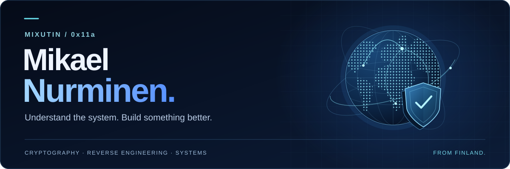

**[Portfolio](https://mixutin.github.io/) · [Projects](https://mixutin.github.io/projects/) · [CTF & security](https://mixutin.github.io/ctf/) · [Suomeksi](https://mixutin.github.io/fi/)**

# Security. Systems. Curiosity.

I'm **mixutin / 0x11a** — a cybersecurity researcher and CTF player.

I take systems apart to understand them, then build something useful with what I learn. My work spans cryptography, reverse engineering, native tools and game preservation. I care about keeping software and overlooked media alive after the original services disappear.

## Cryptography & CTFs

I focus on **cryptography and reverse engineering**: understanding the implementation, questioning its assumptions and turning a difficult challenge into an explanation that holds up.

[CTF profile](https://mixutin.github.io/ctf/) · [Writeup index](https://mixutin.github.io/writeups/)

## Building in the open

A selection of my public repositories. Experiments are labelled as experiments; each repository has the latest implementation status.

| Project | What I'm building | Stack / stage |
| :--- | :--- | :--- |
| **[Vibrix](https://github.com/mixutin/Vibrix)** | An independent Rust operating system, working toward a persistent, portable USB-first system. [Website ↗](https://mixutin.github.io/Vibrix/) | Rust · x86-64 · UEFI **Experimental OS** |
| **[Lumina](https://github.com/mixutin/Lumina)** | A Steam-free Linux launcher project for the official HoYoPlay launcher and Zenless Zone Zero, built around UMU/Proton. [Website ↗](https://mixutin.github.io/Lumina/) | Rust · Tauri · Linux **Pre-alpha** |
| **[Mallow](https://github.com/mixutin/Mallow)** | Native Apple Silicon tooling working toward Windows compatibility, starting with Wine installation and integrity checks. [Website ↗](https://mixutin.github.io/Mallow/) | Swift · macOS · Wine **Development preview** |
| **[Dauntless Revived](https://github.com/mixutin/dauntless-revived)** | Game preservation through reverse engineering and a self-hosted backend. A modified fork of Undaunted. [Docs ↗](https://mixutin.github.io/dauntless-revived/) | TypeScript · Backend **Community revival** |
| **[Jake / JKI](https://github.com/mixutin/JKI)** | A voice-controlled Linux desktop companion for Codex, combining local speech recognition, spoken replies and a GTK interface. | Python · GTK 4 **Desktop tooling** |

**Development notes:** Vibrix's persistent USB system is a goal, not a finished release. Lumina is pre-alpha. Mallow's preview installs and verifies Wine; it **does not run Windows programs yet**. See the linked repositories before trying development builds.

**Upstream credit:** Dauntless Revived builds on **[Undaunted](https://github.com/SyST3MDeV/Undaunted)** by **gwog (Gregory Morford) and contributors**, under **AGPL-3.0**. It is an unofficial fan project; no game files are distributed by the repository.

**[Explore the project portfolio →](https://mixutin.github.io/projects/)**

## What I work with

**Security & analysis** — Cryptography · Python · x86-64 · Windows PE · binary analysis · reverse engineering

**Systems & desktop** — Rust · C · C++ · Swift · Linux · macOS · UEFI · QEMU

**Backends & creative tools** — TypeScript · JavaScript · Node.js · SQLite · GitHub Actions · Unity · Roblox / Luau · Blender · MCP

Tools change. The habit stays the same: **read the code, test the assumptions, document what actually works.**

## Connect

For project questions, ideas or contributions, start with the relevant repository. My **[portfolio](https://mixutin.github.io/)** has more background, **[project pages](https://mixutin.github.io/projects/)** and **[CTF notes](https://mixutin.github.io/blog/)**.

Found a security issue? Follow the project's **[security policy](https://github.com/mixutin/.github/blob/HEAD/SECURITY.md)** rather than posting vulnerability details or secrets in a public issue.

---

<strong>🇫🇮 Suomeksi</strong>

### Hei, olen mixutin / 0x11a

Olen tietoturvan tutkija ja CTF-kilpailija. Keskityn kryptografiaan, takaisinmallinnukseen ja avoimen lähdekoodin ohjelmistoihin.

Julkisia projektejani ovat **Vibrix**, **Lumina**, **Mallow**, **Dauntless Revived** ja **Jake / JKI**. Niissä yhdistyvät käyttöjärjestelmät, työpöytätyökalut, pelien säilyttäminen ja tekoälyavusteinen kehitys. Projektitaulukon linkeistä löydät lähdekoodin ja kehitysvaiheen. Vibrixin pysyvä USB-järjestelmä on vielä tavoite, Lumina on esialfa ja Mallow ei vielä suorita Windows-ohjelmia. Dauntless Revived perustuu gwogin ja muiden tekijöiden Undauntediin (AGPL-3.0).

[Portfolio](https://mixutin.github.io/fi/) · [Projektit](https://mixutin.github.io/fi/projects/) · [CTF & tietoturva](https://mixutin.github.io/fi/ctf/) · [Yhteys](https://mixutin.github.io/fi/contact/)

<!-- Updated 2026-09-29. Project sources: the linked public repositories.
Artwork is repository-local; no analytics, counters or third-party image services.
Design and implementation assisted by GPT-6 Astra Pro at the owner's request. -->
